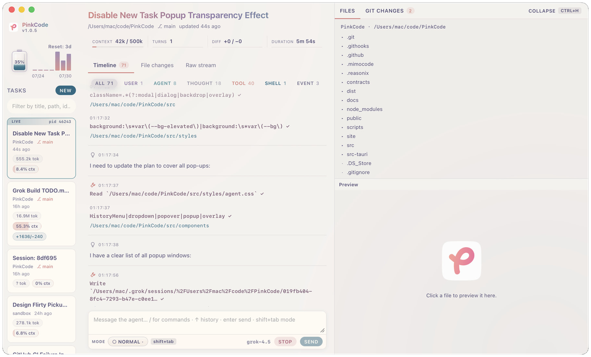

<!-- Relative path so GitHub does not rewrite via camo (often broken in CN). -->
<p align="center">
  
</p>

<h1 align="center">PinkCode</h1>

<p align="center">
  <strong>Desktop mission control for Grok agents.</strong>
</p>

<p align="center">
  <a href="#screenshot">Screenshot</a>
  ·
  <a href="#what-it-does">What it does</a>
  ·
  <a href="#quick-start">Quick start</a>
  ·
  <a href="#architecture">Architecture</a>
  ·
  <a href="docs/TODO.md">Roadmap</a>
</p>

A desktop console for [Grok Build](https://x.ai): multi-task board, ACP timeline, workspace files/Git, permissions, and usage. It attaches to `grok` over ACP — it does not run its own agent loop.

**Tauri 2 · React · TypeScript · Rust** · current version **0.2.2**

## Screenshot

<p align="center">
  
</p>

## What it does

| Area | Behavior |
|------|----------|
| **Tasks** | Lists sessions under `~/.grok` / `%USERPROFILE%\.grok`. New task, select, prompt, stop. First send auto-connects ACP (no attach toggle). |
| **Timeline** | One stream: user / agent / thought / tool / shell / plan / events. Live ACP when connected; otherwise hydrate from session `updates.jsonl`. Filters + stick-to-bottom. |
| **File changes** | Agent hunks from `hunk_records.jsonl`. |
| **Raw** | Tail of on-disk ACP `session/update` records. |
| **Workspace** | Project file tree + Git porcelain status (right rail). |
| **Mode** | Grok Shift+Tab ring: **Normal → Plan → Auto → Always-approve**. Plan is orthogonal to permission (next free-text becomes `/plan …`). When the agent calls `exit_plan_mode`, PinkCode shows a **plan approval** panel (Approve / Request changes / Quit) via Grok’s `x.ai/exit_plan_mode` reverse-RPC. `/view-plan` is local. Auto / Always-approve update the **host ACP gate only** (no `session/prompt` side effects). |
| **Permissions** | Host gate also supports Accept edits and Don't ask (New Task spawn). Per-task prefs under `~/.pinkcode` (permission + Plan arming). |
| **Usage** | Week remaining (Grok billing API) + recent day token series from local sessions. |
| **Updates** | Checks GitHub Releases on startup; optional download & install. Title bar shows `PinkCode <version>`. |

Prebuilt installers: **[Releases](https://github.com/3xian/PinkCode/releases)** (Windows x64 NSIS, macOS Apple Silicon & Intel). Linux: build from source (no CI installer yet).

## Quick start

### 1. Install Grok Build first

PinkCode attaches to [Grok Build](https://grok.com/build) over ACP — install the CLI before running PinkCode.

**Windows (PowerShell):**

```powershell
irm https://x.ai/cli/install.ps1 | iex
```

**macOS / Linux / WSL:**

```bash
curl -fsSL https://x.ai/cli/install.sh | bash
```

After install, the `grok` binary and data live under `~/.grok` (or `%USERPROFILE%\.grok` / `GROK_HOME` on Windows).

### 2. Dev prerequisites

| | macOS | Windows 11 | Linux |
|---|---|---|---|
| Node | 24+ | 24+ | 24+ |
| Rust | stable | stable (`x86_64-pc-windows-msvc`) | stable |
| Platform | Xcode CLT | MSVC Build Tools + [WebView2](https://developer.microsoft.com/microsoft-edge/webview2/) | webkit2gtk (see Tauri docs) |
| Grok Build | installed (step 1) | installed (step 1) | installed (step 1) |

Windows toolchain (once):

```powershell
winget install Microsoft.VisualStudio.2022.BuildTools --override "--wait --passive --norestart --add Microsoft.VisualStudio.Workload.VCTools --includeRecommended"
```

```powershell
powershell -ExecutionPolicy Bypass -File scripts/windows-setup.ps1
```

### 3. Build and run PinkCode

```bash
npm install
npm run tauri:dev          # development
npm run tauri:build        # local installer under src-tauri/target/release/bundle/
npm run check              # frontend + Rust (fmt/clippy/test) — same as CI
```

**Env (optional)**

| Variable | Meaning |
|----------|---------|
| `GROK_BIN` | Path to `grok` / `grok.exe` |
| `GROK_HOME` | Grok data root (default `~/.grok`) |
| `PINKCODE_HOME` | PinkCode prefs root (default `~/.pinkcode`) |

## Architecture

```
UI (React)
  ├─ invoke()  →  sessions, spawn/attach/prompt/stop, permissions,
  │               week usage, token series, project FS, git status
  └─ listen()  ←  agent-update | agent-status | agent-permission
                    | agent-shell | agent-prompt-complete | sessions-changed
        │
        ├─► AgentManager — N × `grok agent stdio` (ACP) + permission gate
        └─► Session index — FS watch on ~/.grok/sessions, cards, hunks, stats
```

## License

Copyright (c) 2026 david. All rights reserved. Published without an open-source license.
